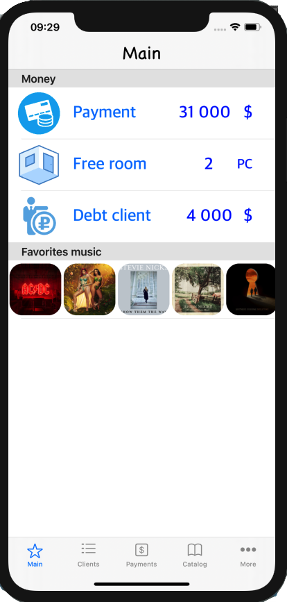

# Rent-of-rooms

Efficient automation of all accounting processes for leases, contracts and payments.

Аренда помещений.

Эффективная автоматизация всех процессов учета договоров аренды, договоров и платежей.

https://youtu.be/AutfI1ee7xM

Used:
•	Swift
•      CocoaPods
•	Protocols
•	Extension
•	MapKit
•	WebKit
•	CoreLocation
•	Core Data
•	DispatchQueue
•	Autolayout
•	MVC
•	Interface Builder
•      Storyboard/Xib
•	JSON
•	Localizable
•	MFMailComposeViewController

UIKit:
•	UITabBarController
•	UIPageViewController
•	UIViewController
•	UIStoryboardSegue
•	UIStoryboardUnwindSegueSource
•	UITableViewController
•	UITableViewCell
•	UICollectionView
•	UIRefreshControl
•	Basic UIView Animation
•	UIBlurEffect
•	UIToolbar
•	UISearchController
•	UIAlertController
•	UIBarButtonItem
•	UIImagePickerController
•	UIProgressView

Foundation:
•	URLSession
•	NSPredicate
•	DateFormatter
•	NumberFormatter
•	UserDefaults
•	Timer
